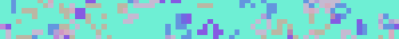

# Godot 4.3 Conway's Game of Life, Tiling Images Edition

If you have a desire for a tiling texture or background of randomized games of [Conway's Game of Life](https://en.wikipedia.org/wiki/Conway%27s_Game_of_Life), specifically as 500x500px PNGs, this is the tool for you!

[Try it out on itch.io.](https://smkrv.itch.io/buncha-games-of-life)

## Overview
Based on a few parameters, the applet generates multiple games of life. Each round an image is created by layering the games. Images can be saved to your device.

Palette and game generation should be deterministic. The same parameters should produce the same games. Colours should be generated in the same order, but palette grouping is based on the number of games in play.

## Input methods
Interact via mouse, keyboard, or touch (the typing experience on mobile web is not great, but should work). A text input method is required to change the RNG seed.

## Options
Most parameter changes will reset and regenerate the games.
- **Seed**: Set the seed used to generate colour palettes and the initial game states. Regenerates games, but does not regenerate palette.
- **Number of games**: The number of games to play. Regenerates games.
- **Grid size**: The size of the grid for the games. Regenerates games.
- **Show ghost**: Show the previous image at low opacity over the current image. Purely for aesthetics. Does not regenerate games.

## Interaction
- **Next Round**: Generate the next round of each game and update the image. This gets a bit sluggish when both grid size and the number of games are set a little higher.
- **New Palette**: Generate a new palette using the current seed. The RNG seed and state for this is reset whenever the seed is updated, but palettes are not automatically regenerated on parameter changes.
- **Save Image**: Attempts to save the current texture to user data on Desktop, and wherever a user's browser downloads go on Web builds.

## Behaviour

### Palette Generation
Palette size is based on the number of games in play, plus one more colour for the background. Colours in palettes are created with `Color(rng.randf(), rng.randf(), rng.randf())`, so RNG state is based on the number of colours generated, and not the number of palettes generated.

### Game Generation
Each game receives a modified version of the current seed, which is used to decide whether the initial state of any cell is live or dead. RNG seeds for each game are based on its position in the list of all current games and stay consistent between regenerations using the same seed and grid size.

### Calculating Rounds
Standard Game of Life rules apply, but coordinates wrap when out of bounds. i.e. index `maxIndex + 1` is treated as index `0`, and index `-1` is treated as index `maxIndex`.

## Todos
Should I come back to this, a liesurely list of features and fixes.
- [ ] Add GIF handling in the tool.
  - [ ] Save Frame button
  - [ ] Show said frames in UI
  - [ ] Generate GIF button
  - [ ] Settable frame delay
- [ ] Make image file names more customizable and readable (preferably custom prefix + round number).
- [ ] Make save folder settable by user on Desktop. (`user://` is maybe not the ideal place for things a user wants to get at.)
- [ ] Set seed from list on initialization.
- [ ] Make the opaque layers image constructor more performant. (See if blending whole images is faster.)
- [ ] Make grid size settable on x and y
- [ ] Custom image size
- [ ] Make the UI not become humongous when the window is wide and big.
- [ ] Make image constructors selectable. (There's only one other one)
- [ ] Expose tiling toggle to show texture without tiling.
- [ ] Make the ghost not persist between grid size changes. It doesn't look great.
- [ ] UI Theming
- [ ] Make spin boxes more usable on mobile
- [ ] Update palette generation to be more consistent regardless of palette sizes.

## Screenshots

